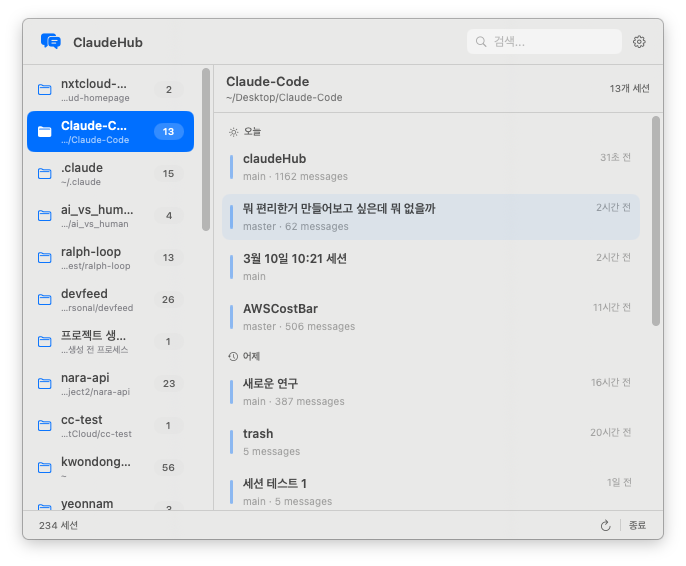

# ClaudeHub

macOS menu bar app that shows all your Claude Code sessions across every project and lets you resume any session with one click.

  



## Why

Using Claude Code across multiple projects means switching directories and running `/resume` to find the right session every time. ClaudeHub puts all sessions from every project in one place — click a session, and it opens in your terminal, ready to go.

## What it does

- **All sessions, one view** — scans `~/.claude/projects/` and lists every session grouped by project
- **One-click resume** — click a session card to open it in your preferred terminal
- **Multi-terminal support** — Terminal.app, iTerm2, Warp, Ghostty
- **Search** — filter sessions by title or project name
- **Pin sessions** — bookmark important sessions so they stay at the top
- **Delete sessions** — remove old sessions with inline confirmation
- **Auto-refresh** — configurable interval (5s / 10s / 30s / manual)
- **Smart path detection** — resolves Claude's encoded folder names back to real filesystem paths

## How it works

Claude Code stores session data as JSONL files under `~/.claude/projects/<encoded-path>/`. ClaudeHub scans these directories, parses each `.jsonl` file to extract the session title (first user message), git branch, and timestamps, then displays them in a split-pane UI.

When you click a session:
- **Terminal.app / iTerm2** — uses AppleScript to open a new tab and run the resume command
- **Warp / Ghostty** — creates a temporary shell script in the project directory and opens it with `open -a`, so the terminal's file tree shows the correct project

## Requirements

- macOS 13 Ventura or later
- [Claude Code](https://docs.anthropic.com/en/docs/claude-code) installed
- No external dependencies

## Install

### Option A — DMG

1. Download `ClaudeHub.dmg` from the [Releases](https://github.com/Kwondongkyun/ClaudeHub/releases) page
2. Open the DMG and drag **ClaudeHub** into **Applications**
3. Launch from Applications or Spotlight

### Option B — Build from source

```bash
git clone https://github.com/Kwondongkyun/ClaudeHub.git
cd ClaudeHub
bash build.sh
```

`build.sh` compiles a release binary, creates `ClaudeHub.app`, signs it ad-hoc, produces `ClaudeHub.dmg`, and optionally copies the app to `/Applications`.

## Run

```bash
open /Applications/ClaudeHub.app
```

ClaudeHub runs as a menu bar agent — no Dock icon. Click the menu bar icon to open the panel. To quit, click **종료** in the footer.

## Project structure

```
ClaudeHub/
├── Package.swift
├── build.sh                              # Build, bundle, sign, DMG
└── Sources/
    ├── ClaudeHubApp.swift                # @main entry point (MenuBarExtra)
    ├── Models/
    │   ├── Project.swift                 # Project model (sorted sessions, pin count)
    │   └── Session.swift                 # Session model (title, branch, relative time)
    ├── Services/
    │   ├── AppSettings.swift             # Terminal selection, refresh interval
    │   ├── SessionParser.swift           # JSONL parser (first 64KB for performance)
    │   ├── SessionScanner.swift          # Filesystem scanner with greedy path matching
    │   └── TerminalLauncher.swift        # Terminal-specific launch logic
    └── Views/
        └── MainView.swift                # Split-pane UI (sidebar + session cards)
```

## License

MIT
